# LOST ENERGY

## Game Design Document

### Third-Person Adventure / Resource Management Game

| Title            | Info                        |
| ---------------- | --------------------------- |
| Developer        | Doğukan Parlak - 221805040 |
| Engine           | Unity 6 (URP)               |
| Target Platform  | Windows (PC)                |
| Document Version | 1.0                         |
| Project Version  | 1.0                         |
| Date             | April 2026                  |


*Figure 1. Main cover artwork created for Lost Energy.*


*Figure 2. Alternative cover design supporting the game's atmosphere and narrative tone.*

---

## Table of Contents

1. [Design History](#1-design-history)
2. [Game Overview](#2-game-overview)
3. [Feature Set](#3-feature-set)
4. [Game World](#4-game-world)
5. [Camera and Controls](#5-camera-and-controls)
6. [Gameplay Systems](#6-gameplay-systems)
7. [World Layout and Progression Flow](#7-world-layout-and-progression-flow)
8. [Characters](#8-characters)
9. [User Interface](#9-user-interface)
10. [Audio and Music](#10-audio-and-music)
11. [Single-Player Experience](#11-single-player-experience)
12. [Story and Narrative](#12-story-and-narrative)
13. [Technical Implementation](#13-technical-implementation)
14. [Asset and License Information](#14-asset-and-license-information)
15. [Setup and Installation](#15-setup-and-installation)

---

## 1. Design History

### Version 1.0

This version represents the submission-ready current design document for the Lost Energy project.

- Three playable scenes completed: `SampleScene`, `SampleScene2`, `SampleScene3`.
- Third-person character control, orbit camera, and interaction system integrated.
- Oxygen-based resource management, crystal collection loop, and hazard zone system completed.
- Main menu, pause menu, settings panel, and loading screen implemented.
- NPC dialogue system, scene transition flow, and basic audio management completed.
- Asset, resource, and license information integrated into the document.

---

## 2. Game Overview

### Game Description

Lost Energy is a single-player third-person adventure game. The player manages their oxygen to survive on a fragmented island floating in the void, collects crystals scattered across the environment, avoids hazardous zones, and unlocks doors that advance progression between scenes.

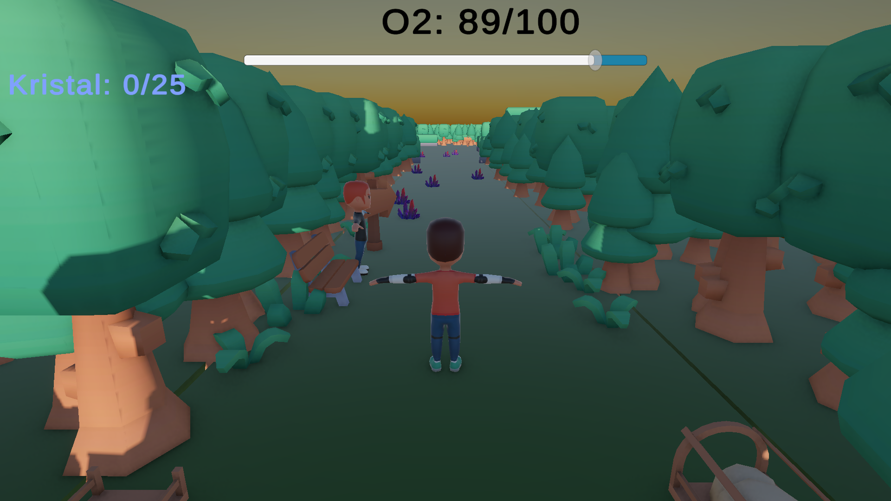

*Figure 3. General gameplay view showing the player character, HUD, and scene layout together.*

### Design Goals

- Build gameplay that is quickly understood through simple rules yet creates sustained pressure.
- Use the oxygen mechanic simultaneously as a life indicator, time pressure, and strategic resource.
- Combine environmental threats, exploration, and storytelling into a short yet cohesive experience.
- Produce a vertical slice with a manageable scope for academic submission that feels complete.

### Core Design Principles

#### 1. Constant Pressure

The player loses oxygen even in safe areas. As a result, inactivity is penalized, decision-making is accelerated, and every crystal becomes meaningful.

#### 2. Clear Objectives

The crystal objective is explicit in the first two scenes. The player can always see how many to collect, when the door will open, and what the progression condition is.

#### 3. Environmental Storytelling

Red hazardous surfaces, scene transitions, island boundaries, and guard dialogues work together to reinforce the world's fractured structure.

### Key Frequently Asked Questions

#### What is the game?

A short third-person adventure experience built on resource management, exploration, and scene-based progression.

#### Where does the game take place?

The game takes place in an island system floating in the void, part of an incomplete creation.

#### What does the player control?

A single character is controlled. The character moves, jumps, interacts, collects crystals, and progresses between scenes.

#### What is the main focus of the game?

The main focus is choosing the right route under oxygen pressure, collecting crystals, and reaching the exit.

#### What makes this game different?

The oxygen system is not merely a health indicator; it is the core mechanic that simultaneously determines time pressure, route optimization, and reward structure.

---

## 3. Feature Set

### Core Gameplay Features

- Third-person character control
- Freely rotating orbit camera system
- Real-time oxygen consumption and replenishment system
- Crystal collection and objective completion structure
- `IInteractable`-based interaction architecture
- Additional oxygen drain from hazard zones
- Death/respawn flow triggered by falling and oxygen depletion
- NPC dialogue system and scene-linked narrative delivery

### Supporting Systems

- Main menu and pause menu
- Settings panel and volume control
- Scene transitions via loading screen
- Per-scene music switching
- VFX and SFX support for crystal collection
- Branching ending selection in the final scene

### User Experience Features

- Always-visible oxygen and crystal indicators
- On-screen prompt text for nearby interactable targets
- Explicit control scheme
- Compact level structure suited to short play sessions

---

## 4. Game World

### General Structure

The Lost Energy world is designed as an incomplete realm of existence. The island is physically bounded; stepping beyond the boundaries results in death. Each new scene represents an area where the deterioration has become more visible.

### World Features

#### Fragmented Island Structure

The play area is built on a layout where safe surfaces and risky gaps coexist. This makes navigation, staying on platforms, and choosing safe routes important.

#### Deterioration Zones

Red hazardous surfaces do not merely provide visual variety; they are mechanical threat zones that force the player to alter their route.

### Physical World Summary

| Property        | Value             |
| --------------- | ----------------- |
| Perspective     | Third-person (3D) |
| Walk Speed      | 10 units/s        |
| Sprint Speed    | 25 units/s        |
| Jump Height     | 1.5 units         |
| Camera Distance | 5 units           |

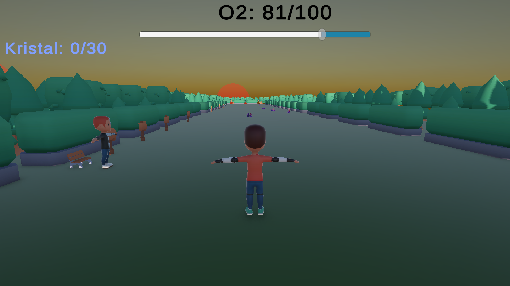

*Figure 4. General view of the second scene where deterioration has increased.*

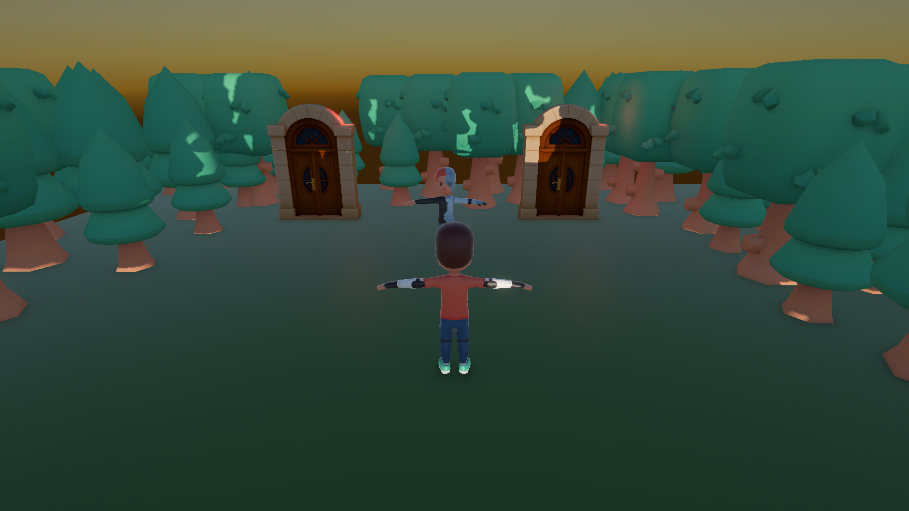

*Figure 5. General environment view of the final section.*

---

## 5. Camera and Controls

### Camera System

The camera system is managed within `PlayerController3P`. The camera orbits around the player; yaw and pitch inputs are handled independently. Because movement direction is calculated relative to the camera's facing direction, the control feel is designed similarly to third-person action games.

| Parameter         | Value   |
| ----------------- | ------- |
| Mouse Sensitivity | 0.2     |
| Pitch Minimum     | -30°   |
| Pitch Maximum     | +60°   |
| Camera Distance   | 5 units |

### Control Scheme

| Action                 | Input             |
| ---------------------- | ----------------- |
| Move                   | WASD / Arrow Keys |
| Jump                   | Space             |
| Sprint                 | Left Shift        |
| Interact               | E                 |
| Camera                 | Mouse             |
| Pause / Release Cursor | ESC               |

---

## 6. Gameplay Systems

### Oxygen System

Oxygen is the game's primary resource structure. The player consumes oxygen as long as they are in a scene. When the value reaches zero, the character dies and returns to the last safe starting point.

| Area    | Starting Oxygen | Normal Drain | Hazard Extra Drain | Crystal Bonus |
| ------- | --------------- | ------------ | ------------------ | ------------- |
| Scene 1 | 100             | 3 units/s    | +5 units/s         | +5            |
| Scene 2 | 100             | 3 units/s    | +6 units/s         | +6            |

### Crystal System

- Crystals are spawned in defined areas within the scene.
- The player collects a crystal by interacting via the `E` key.
- Visual and audio feedback is generated during the collection action.
- In the first two scenes, the exit door opens once the crystal target is met.
- In the final scene there is no crystal target; the ending choice is presented directly to the player.

### Hazard Zone System

- `HazardZone` areas increase oxygen consumption.
- These zones are visually marked with red surfaces.
- Music and tension are intensified upon entering a hazard area.

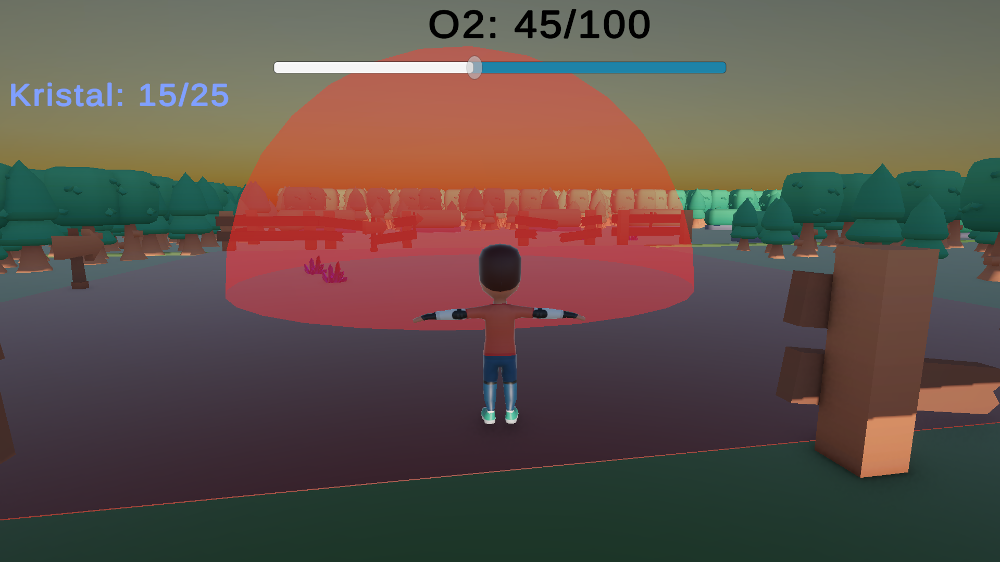

*Figure 6. Example screenshot showing the effect of a hazard zone on the play area.*

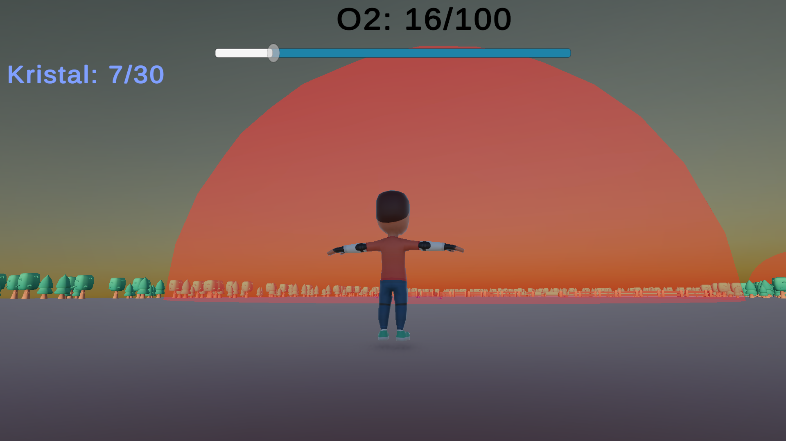

*Figure 7. Second view showing the pressure a hazard area exerts on the player.*

### Interaction System

The interaction structure is built on the `IInteractable` interface. Crystals, doors, NPCs, and potions all use the same approach. `PlayerInteraction` determines the best target for the player and displays the appropriate prompt text on screen.

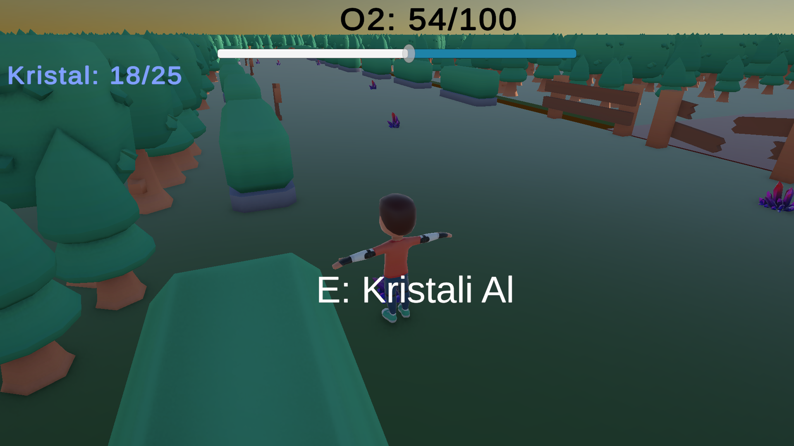

*Figure 8. Interaction prompt and HUD components visible at the moment of crystal collection.*

### Reward and Progression Loop

```text
Collect crystal -> Replenish oxygen -> Survive longer
               -> Collect more crystals -> Complete objective
               -> Open exit door -> Transition to new scene
```

---

## 7. World Layout and Progression Flow

### General Flow

The game consists of three main scenes. In the first two scenes the player collects a set number of crystals; in the third scene the experience is concluded or looped through a final choice.

### Scene 1 – Island Entrance

| Field          | Description                                         |
| -------------- | --------------------------------------------------- |
| Atmosphere     | Relatively calm starting area                       |
| Crystal Target | 25                                                  |
| Hazards        | Falling off island edge, low-intensity hazard areas |
| NPC            | Guard                                               |
| Exit           | Scene 2 via `ExitDoorSceneLoader`                 |

### Scene 2 – Deteriorated Zone

| Field          | Description                                                        |
| -------------- | ------------------------------------------------------------------ |
| Atmosphere     | Increased deterioration, more aggressive risk areas                |
| Crystal Target | 30                                                                 |
| Hazards        | Falling off island edge, dense hazard zones, harder route pressure |
| NPC            | Guard                                                              |
| Exit           | Scene 3 via `ExitDoorSceneLoader`                                |

### Scene 3 – End of Creation

| Field          | Description                                        |
| -------------- | -------------------------------------------------- |
| Atmosphere     | The final threshold of an unfinished existence     |
| Crystal Target | 0                                                  |
| Hazards        | Final decision — return or exit choice            |
| NPC            | Guard                                              |
| Exit           | Loop end or win screen via `FinalDoorController` |

### Game Flow Diagram

```text
Main Menu
  -> LoadingScreen
  -> Scene 1
  -> Scene 2
  -> Scene 3
     -> Loop Door: Return to Scene 1
     -> Exit Door: Congratulations screen
```


*Figure 9. Loading screen used for transitions between scenes.*

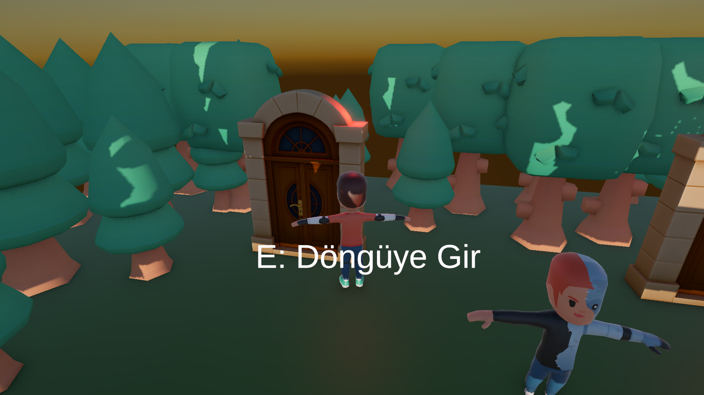

*Figure 10. Door interaction in the final scene offering the option to loop back.*

---

## 8. Characters

### Player Character

| Property         | Description                                                 |
| ---------------- | ----------------------------------------------------------- |
| Model            | Kenney Animated Characters Protagonists                     |
| Control Setup    | `PlayerController3P` + `CharacterController`            |
| Primary Goal     | Collect crystals and reach the exit under oxygen management |
| Death Conditions | Oxygen reaching zero or falling such that `Y < -1`        |

### NPC – Guard

The Guard is the game's sole narrative-focused NPC. In each scene they greet the player, provide information about the area, and gradually reveal the world's backstory. Because the character is integrated with the island they cannot leave this world, which reinforces their role in the narrative.

### Dialogue System Behavior

- Managed via the `NPCDialogue` and `DialogueData` structures.
- Oxygen consumption is paused while dialogue is active.
- Dialogue simultaneously delivers system tutorials and story content to the player.

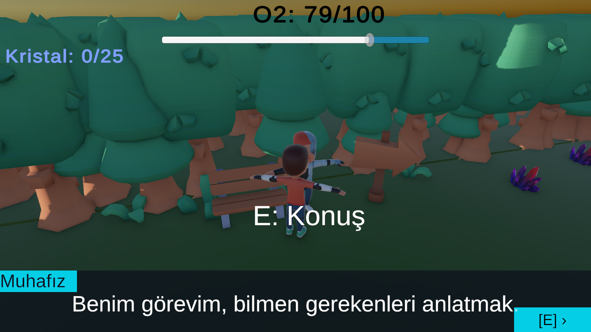

*Figure 11. Dialogue panel opening during interaction with the Guard character.*

---

## 9. User Interface

### HUD Components

| Component          | Function                                                         |
| ------------------ | ---------------------------------------------------------------- |
| Oxygen Slider      | Visually displays the current oxygen level                       |
| Oxygen Value       | Shows the numerical value of oxygen                              |
| Crystal Counter    | Displays collected crystal count in `current / target` format  |
| Interaction Prompt | Provides contextual information for a nearby interactable object |

### Panel Structure

| Panel          | Trigger Condition                             |
| -------------- | --------------------------------------------- |
| Game Over      | Oxygen depletion or fall death                |
| Win            | Selecting the victory exit in the final scene |
| Pause          | ESC key                                       |
| Settings       | Accessed from within the pause menu           |
| Controls       | Accessed from the main menu or pause menu     |
| Loading Screen | Opens automatically during scene transitions  |

### Menu Structure

The main menu includes options to start the game, access settings, view controls, and quit. At game start `Time.timeScale = 1f` and the cursor is free.

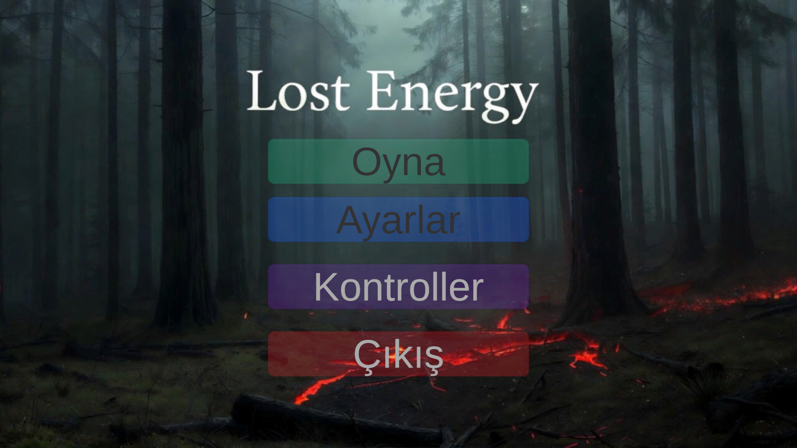

*Figure 12. The game's main menu interface.*

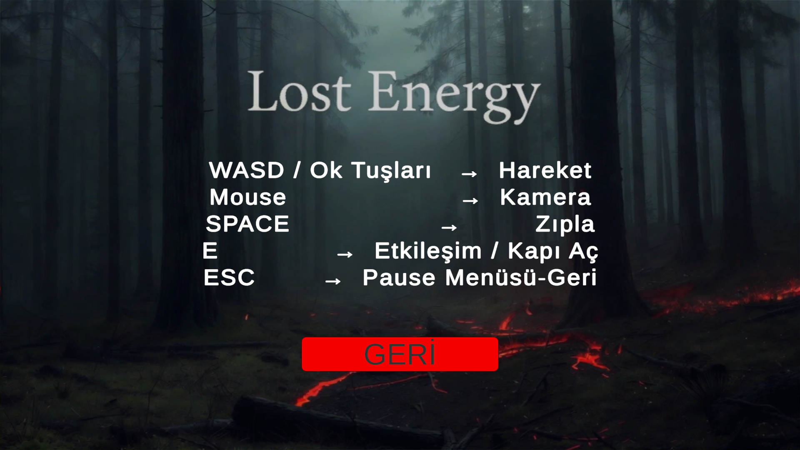

*Figure 13. User interface screen showing the game's control scheme.*

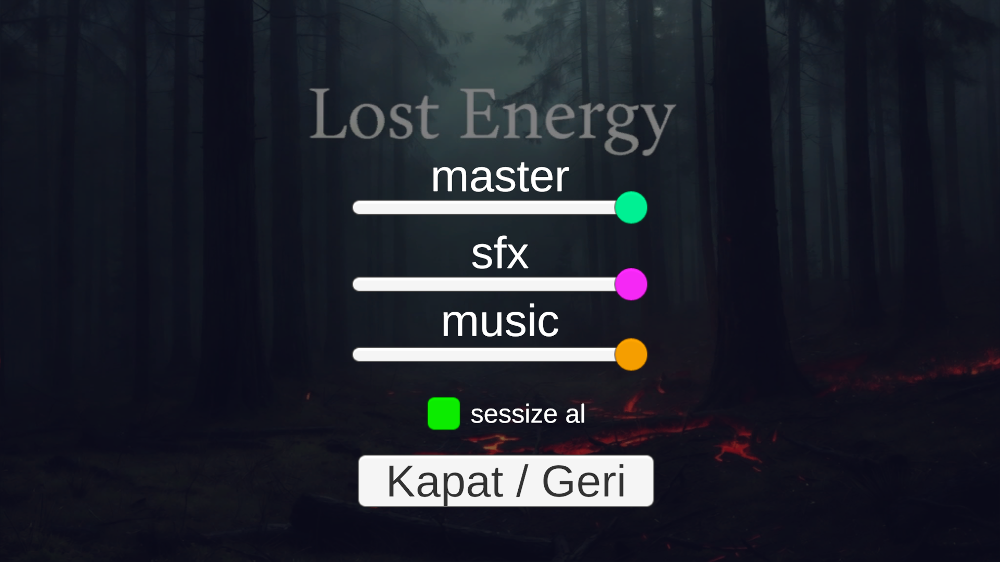

*Figure 14. Settings panel containing volume level and mute options.*

---

## 10. Audio and Music

### Audio Architecture

The project uses three primary channels via `GameAudioMixer`.

| Channel   | Purpose                                             |
| --------- | --------------------------------------------------- |
| MasterVol | Overall volume for all audio                        |
| MusicVol  | Background music tracks                             |
| SFXVol    | In-game effects, dialogue sounds, and hazard alerts |

### Music Usage

- Different music streams are used for the main menu and gameplay scenes.
- Hazard areas are supported with additional audio layers to heighten tension.
- `MusicManager` maintains music continuity across scene transitions.

### Source Summary

| Source                          | Content                                                 |
| ------------------------------- | ------------------------------------------------------- |
| Flowerhead - SomeWhatGood: Lofi | `Observatory and chill 2`                             |
| Not Jam Music Pack              | `ChillMenu`, `CriticalTheme`, `SwitchWithMeTheme` |
| Freesound                       | Crystal collection and NPC sound effects                |

---

## 11. Single-Player Experience

### Game Loop

The single-player experience is built on a scene-based structure that is brief but generates intense decision pressure. In each scene the player reads the environment, evaluates risky routes, collects crystals, and reaches the exit door.

### Estimated Playtime

| Play Style                       | Duration       |
| -------------------------------- | -------------- |
| Fast Completion                  | 5–6 minutes   |
| Exploration and Dialogue Focused | 10–12 minutes |

### Win and Lose Conditions

| State | Condition                                                        |
| ----- | ---------------------------------------------------------------- |
| Win   | Selecting the exit ending via `FinalDoorController` in Scene 3 |
| Lose  | Oxygen reaching zero or falling out of the scene                 |

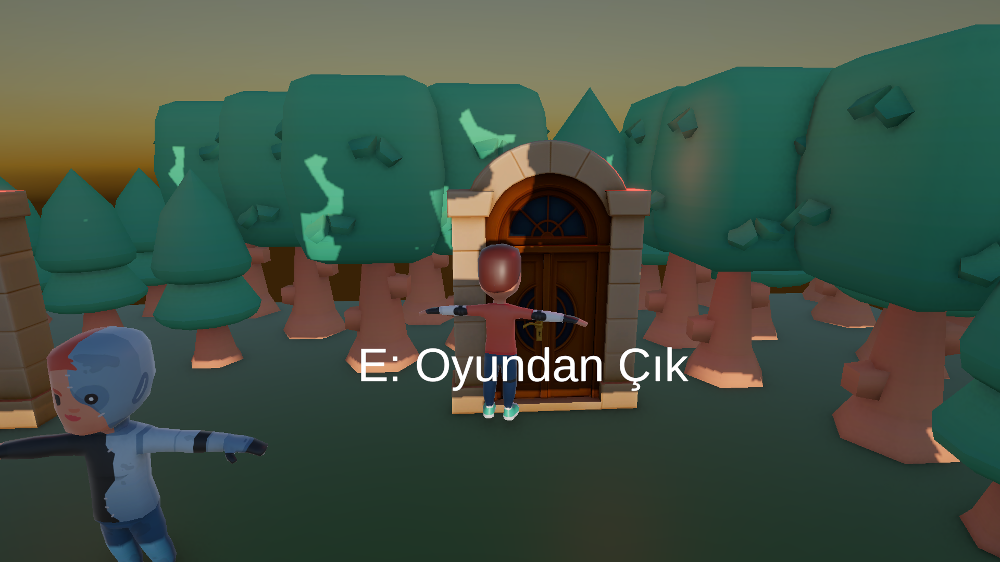

*Figure 15. Exit door interaction offering the option to complete the game.*

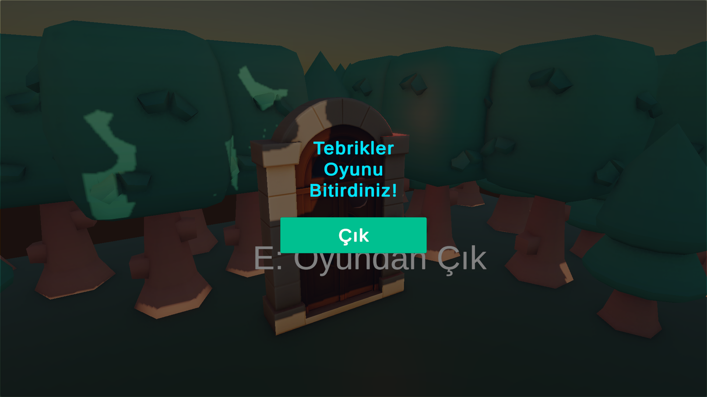

*Figure 16. Result screen displayed after completing the game.*

---

## 12. Story and Narrative

### Story Summary

Lost Energy follows a character trapped inside an incomplete creation, searching for a way out. The game world is an existence space that cannot fully perform its function; as a result, even oxygen is unstable. The red deterioration zones represent the world's dissolving structure. Crystals function as fragments that have managed to remain intact within this broken order.

### Thematic Structure

| Element    | Meaning                                              |
| ---------- | ---------------------------------------------------- |
| Island     | An incomplete creation                               |
| Oxygen     | The world's unstable and deficient nature            |
| Crystals   | Preserved fragments of reality                       |
| HazardZone | Physical manifestation of deterioration              |
| Guard      | A witness aware of the system but unable to leave it |

### Scene-by-Scene Narrative Development

| Scene   | Narrative Function                                              |
| ------- | --------------------------------------------------------------- |
| Scene 1 | Introduction of world rules and the primary objective           |
| Scene 2 | Intensification of deterioration and danger                     |
| Scene 3 | Revelation of the truth and presenting the player with a choice |

### Character Motivations

- The player character tries to survive and find the exit before understanding the world they are in.
- The Guard serves a guiding function, acting more out of duty than hope.

---

## 13. Technical Implementation

### Architecture Summary

```text
LostEnergy Namespace
├── GameManager
├── MusicManager
├── SettingsManager
├── SceneLoader
└── UIManager
```

### Core Scripts

| Script                   | Responsibility                                       |
| ------------------------ | ---------------------------------------------------- |
| `PlayerController3P`   | Character movement, sprint, jump, and orbit camera   |
| `OxygenSystem`         | Oxygen consumption and replenishment                 |
| `GameManager`          | Crystal counting, objective checking, and death flow |
| `CrystalCollectible`   | Crystal interaction, SFX and VFX triggering          |
| `HazardZone`           | Applying additional oxygen drain                     |
| `DialogueManager`      | Dialogue flow and oxygen pausing                     |
| `RespawnManager`       | Position reset after death                           |
| `PauseManager`         | Pause flow and panel management                      |
| `LoadingScreenManager` | Asynchronous scene loading and loading screen        |

### Technical Decisions

- Game logic is managed through modular script structures.
- `MusicManager` uses the `DontDestroyOnLoad` approach for cross-scene persistence.
- `SettingsManager` stores audio settings with `PlayerPrefs`.
- References are cached at the `Start()` phase to reduce cost inside `Update()`.

### Performance Notes

- The crystal VFX structure uses `Instantiate + Destroy` approach, sufficient for low object density.
- Scene scales are limited to short gameplay sessions, keeping overall runtime cost controlled.

---

## 14. Asset and License Information

### License Summary

| Source Group                    | License / Usage Terms                            |
| ------------------------------- | ------------------------------------------------ |
| Kenney assets                   | CC0 1.0 Universal                                |
| Unity Asset Store assets        | Standard Unity Asset Store EULA                  |
| Not Jam Music Pack              | CC0 1.0                                          |
| Flowerhead - SomeWhatGood: Lofi | Royalty free (author declaration)                |
| Freesound effects               | Per-file CC license                              |
| Unity built-in packages         | Unity Asset Store EULA / Unity Companion License |

### Kenney Assets

All Kenney assets are published under the [CC0 1.0 Universal](https://creativecommons.org/publicdomain/zero/1.0/) license.

| Asset Pack                       | Version | Source                                       |
| -------------------------------- | ------- | -------------------------------------------- |
| Animated Characters Protagonists | 1.1     | https://kenney.nl/assets/animated-characters |
| Fantasy Town Kit                 | 2.0     | https://kenney.nl/assets/fantasy-town-kit    |
| Graveyard Kit                    | 5.0     | https://kenney.nl/assets/graveyard-kit       |
| Nature Kit                       | 2.1     | https://kenney.nl/assets/nature-kit          |
| Platformer Kit                   | 4.1     | https://kenney.nl/assets/platformer-kit      |

### Unity Asset Store Assets

| Asset Pack       | Publisher | Version |
| ---------------- | --------- | ------- |
| Stylized Crystal | LowlyPoly | 1.0     |
| Stylized door    | lowpoly89 | 1.0     |

License: [Unity Asset Store End User License Agreement](https://unity.com/legal/as-terms)

### Audio and Music Sources

| File / Pack                         | Source                                              | License                           |
| ----------------------------------- | --------------------------------------------------- | --------------------------------- |
| 794489__gobbe57__coin-pickup.wav    | https://freesound.org/people/gobbe57/sounds/794489/ | Per-file Freesound license        |
| 822698__metris__retro-npc-voice.wav | https://freesound.org/people/Metris/sounds/822698/  | Per-file Freesound license        |
| ChillMenu.wav                       | https://not-jam.itch.io/not-jam-music-pack          | CC0 1.0                           |
| CriticalTheme.wav                   | https://not-jam.itch.io/not-jam-music-pack          | CC0 1.0                           |
| SwitchWithMeTheme.wav               | https://not-jam.itch.io/not-jam-music-pack          | CC0 1.0                           |
| Observatory and chill 2.wav         | https://flowerheadmusic.itch.io/somewhat-good-lofi  | Royalty free (author declaration) |

### Unity Built-in Packages

| Package               | Publisher          | License                 |
| --------------------- | ------------------ | ----------------------- |
| TextMesh Pro          | Unity Technologies | Unity Asset Store EULA  |
| Input System          | Unity Technologies | Unity Companion License |
| Post Processing Stack | Unity Technologies | Unity Companion License |

### Usage Notes

- Usage terms for Unity Asset Store assets are covered under the standard Unity EULA.
- For files obtained from Freesound, the license type must be separately verified per file.
- If a CC BY licensed Freesound file is used, written attribution is mandatory.

---

## 15. Setup and Installation

### Development Environment Requirements

- Unity 6 (recommended: 6000.0.x LTS)
- Universal Render Pipeline (URP)
- Input System package

### Minimum System Requirements

- Operating System: Windows 10 64-bit
- Processor: Intel Core i3 class or equivalent
- Memory: 4 GB RAM
- Graphics: DirectX 11 compatible graphics card
- Storage: At least 1 GB free space
- Resolution: 1280 x 720

### Build Steps

1. Open the `File -> Build Settings` menu in the Unity Editor.
2. Verify that the scenes are listed in the following order:
   - `0` MainMenu
   - `1` LoadingScreen
   - `2` SampleScene
   - `3` SampleScene2
   - `4` SampleScene3
3. Select `Windows, x86_64` as the platform.
4. Use the `Build` command and select `Builds/Windows/` as the output directory.

### Running the Game

The compiled build is launched from the `Builds/Windows/Lost Energy.exe` file.

### Quick Control Reference

```text
WASD        -> Move
Left Shift  -> Sprint
Space       -> Jump
E           -> Interact / Collect Crystal
Mouse       -> Camera
ESC         -> Pause Menu
```
